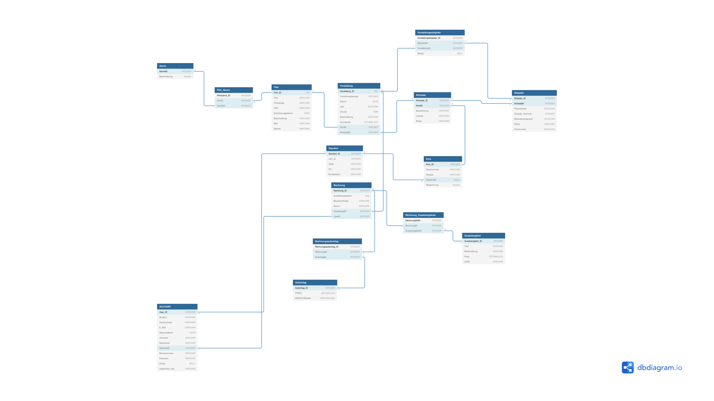

# Datenbank

## ER-Diagramm

-- Das ER-Diagramm befindet sich für bessere Lesbarkeit als PDF-Datei im Repository --

## Datenbank

* MySQL Datenbank verwendet
* PDO um Objektorientiert zuzugreifen
* Daten mittels eines kleinen Java-Programms für den gesamten Monat generiert