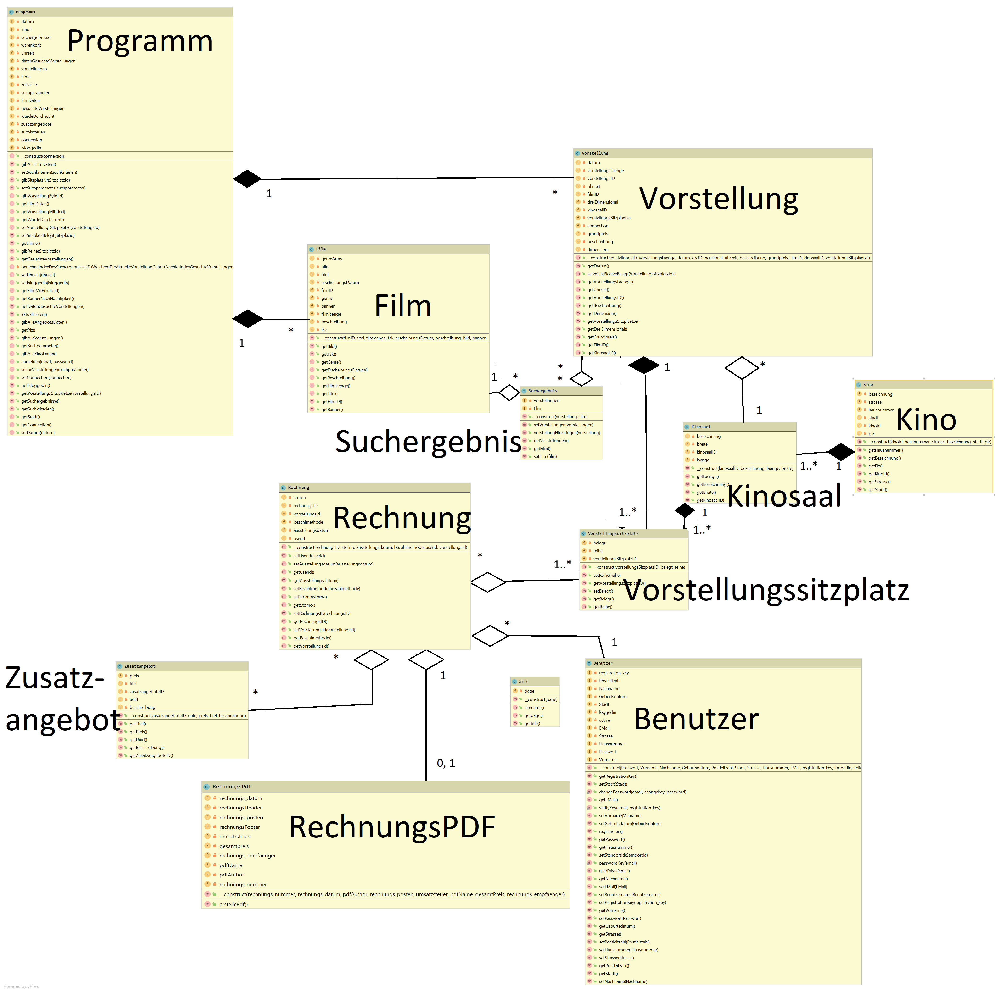
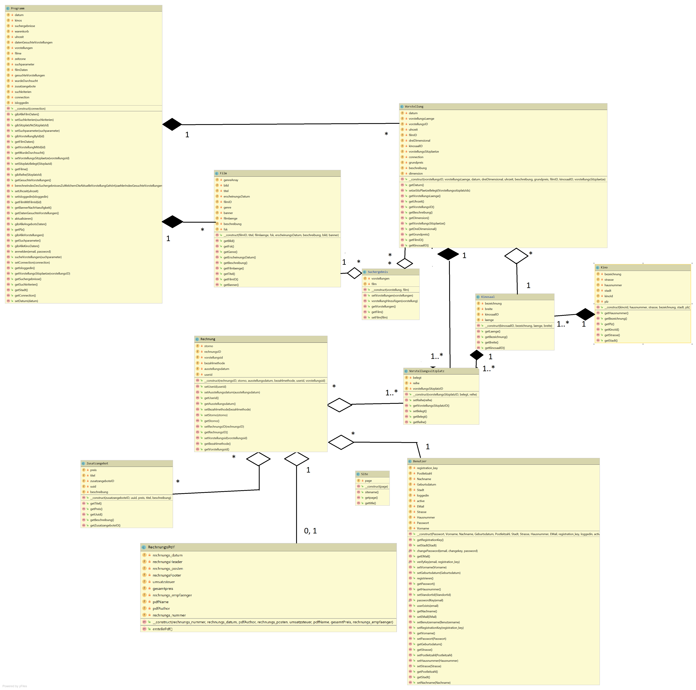

# Fachlogik & Klassendiagramm & Unit-Testing

## Klassendiagramm:

## Fachlogik:

* Die "Programm"-Klasse ist die statische Hauptklasse der Fachlogik und generiert die Objekte aller anderen Klassen
* Ajax um Daten ohne ein erneutes Laden der Seite zu übertragen
* Mittels PDO können SQL Abfragen objektorientiert durchgeführt werden
* Login und Regisrierung auch objektorientiert
* Erstellung der PDF über die Hilfsbibliothek tcpdf

### Buchungsprozess
* Auswahl des Standorts auf der Such-Seite
* Auswahl eines Films oder Auswahl eines Genre oder Alle Filme & Genres
* Auswahl eines Datums
* Auswahl einer Vorstellung eines Films aus den Sucheregebnissen oder
* Ansehen der Filmdetails zu einem FIlm aus den Sucherergebnissen
* Auswahl eines oder mehrerer Sitzplätze
* Ansicht der gebuchten Plätze & des Gesamtpreises im Warenkorb
* Kaufen des Tickets
* Ausgabe des Tickets als PDF

### Umgesetze Funktionalität neben des Buchungsprozesses
* Objektorientierter Slider auf Startseite
* Login, Registrierung, Registrierungsbestätigung, Passwort ändern
* Anzeige aller Filme
* Anzeige aller Standorte
* Anzeiger aller Angebote (Essen & Trinken)

## Unit-Testing:
* Das Unit-Testing wurde mit phpunit und Xdebug umgesetzt
* Es wurde eine Code-Covarage von ca. 60% erreicht

- when installed with composer (phpunit):    
./vendor/bin/phpunit --coverage-html UnitTestResults/
