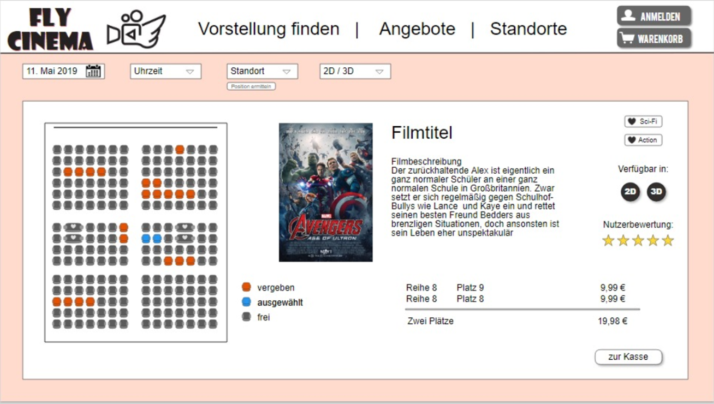

# Frontend

* Umsetzung mit HTML und CSS
* CSS-Framework "Bootstrap" um Zeit zu sparen
* Workflow:
  * Seiten zuerst ohne Integration der Fachlogik entworfen und Mockdaten genutzt
  * Mockdaten anschließend durch Variablen und Methoden der Fachlogik ersetzt
  * Nachträgliche Design Anpassungen
* JavaScript nur bei der Filmsuche eingesetzt
  * Vorteil: Dynamisches Ein- und Ausblenden der Comboboxen ohne neues Laden der Seite

***

### Mockup aus erstem Semester:

