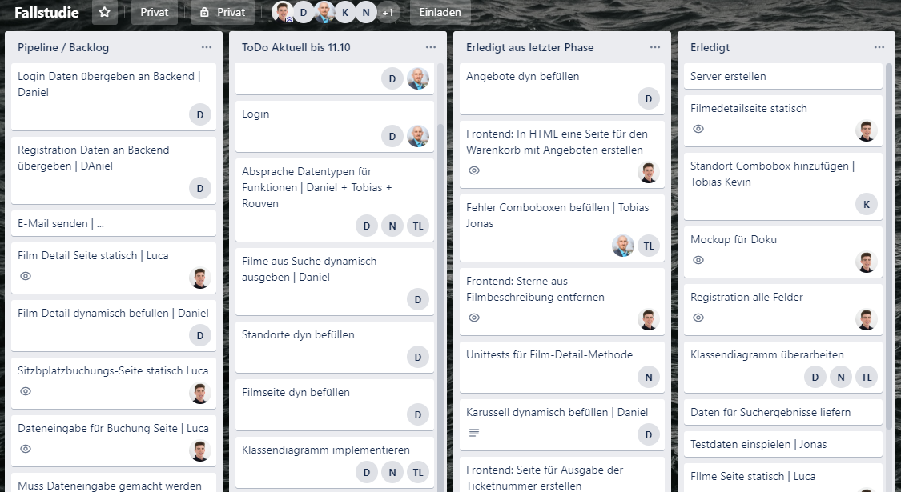

# Organisation des Teams

## Verwendete Projektmanagementmethode :
Auf Grund der besonderen Anforderungen haben wir uns für dieses Projekt eine eigene, individuelle agile Projektmanagementmethode definiert. Als Grundlage dient das Tool „Trello“, dass ein herkömmliches Scrum-Board oder Kanban Tafel ersetzt. Wir haben uns für ein digitales online Tool entschieden, da am Projekt sehr häufig von verschiedenen Standorten gearbeitet wird. Hauptbestandteil unserer Projektmanagement-Methode sind die wöchentlich zweimal stattfindenden Treffen. Diese für 30 Minuten angesetzten Treffen dienen ausschließlich dazu, die Tage seit dem vorherigen Treffen zu reflektieren und kurz auf die geplanten, aber nicht abgeschlossenen Aufgaben einzugehen und zu begründen warum sie nicht abgeschlossen wurden und wann ihre Fertigstellung zu erwarten ist. Daraufhin wird ein neues Gesamtziel für die kommende Phase festgelegt und anschließend schlägt jede Person einige Aufgaben vor, die sie in dieser Phase bearbeiten will.
Die Aufgaben für eine nächste Phasen können entweder aus einem Backlog entnommen werden oder werden ad-hoc erstellt.

## Wachstum der Funktionalität:

## Beschreibung des Projektverlaufs:

Zu Beginn des Projektes legten wir als erstes drei Teams zu je zwei Personen fest, die für einen der drei Bereiche Datenbank, Fachlogik und Frontend zuständig waren. Nach dieser Einteilung legten wir uns fest PHP als Programmiersprache für Fachlogik zu nutzen. Der Frontend HTML sollte in den PHP Code eingebettet werden. 

Die erste Version des Klassendiagramms und die Vorstellung der Fachlogik lagen deutlich neben dem Auftrag und mussten zum Anfang der zweiten Phase korrigiert werden. Bis das finale Klassendiagramm fertig gestellt war und die Implementierung der Klassen beginnen konnte verging ca. ein Drittel der Projektzeit. Daraus risultiert der Knick der Linie des Fachlogik.

Die Datenbank wurde innerhalb der ersten Woche vollständig erstellt. Über das gesamte Projekt hinweg wurden allerdings immer wieder Änderungen eingearbeitet.

Probleme bot über das gesamte Projekt hinweg die Empfindlichkeit des Linux-Servers bezüglich Klein- und Großschreibung. Hier traten immer wieder viele Fehler auf, die Mühsam gesucht werden mussten.

Von zwei Mitgliedern wurde teilweise die Methode des Pair-Programming mit sehr positiven Ergebnissen genutzt. Durch die Verwendung dieser Methode wussten beide genau was der geschriebene Code macht, sie konnten sich Ergänzen und anschließend allein weiterarbeiten. 

Trotz aller Schwierigkeiten hatte das Projekt einen hohen Lerneffekt für alle Beteiligten, da sich jeder mit PHP, SQL, HTML und CSS sowie mit zahlreichen anderen Technik auseinandersetzen musste. Es wurde auch einige Erfahrung mit der Organisation eines Teams bei so einem Projekt gemacht, die in zukünftigen Projekten sicherlich weiterhilft. 
